# Simple REST Service call using APEX

Here I want to invoke a REST service like 
```
GET https://api.weather.gov/points/37.75,-122.50
```
This service returns a `JSON` Object, _that is **not** an array_, nor contains any.
All I need is to get to some attributes of the returned payload.

Here is a sample of the returned payload:
```json
{
    "@context": [
        . . .
    ],
    "id": "https://api.weather.gov/points/37.75,-122.5",
    "type": "Feature",
    "geometry": {
        "type": "Point",
        "coordinates": [
            -122.5,
            37.75
        ]
    },
    "properties": {
        "@id": "https://api.weather.gov/points/37.75,-122.5",
        "@type": "wx:Point",
        "cwa": "MTR",
        "forecastOffice": "https://api.weather.gov/offices/MTR",
        "gridId": "MTR",
        "gridX": 85,
        "gridY": 126,
        "forecast": "https://api.weather.gov/gridpoints/MTR/85,126/forecast",
        "forecastHourly": "https://api.weather.gov/gridpoints/MTR/85,126/forecast/hourly",
        "forecastGridData": "https://api.weather.gov/gridpoints/MTR/85,126",
        "observationStations": "https://api.weather.gov/gridpoints/MTR/85,126/stations",
        "relativeLocation": {
            "type": "Feature",
            "geometry": {
                "type": "Point",
                "coordinates": [
                    -122.464979,
                    37.700941
                ]
            },
            "properties": {
                "city": "Daly City",
                "state": "CA",
                "distance": {
                    "value": 6264.6077562384999,
                    "unitCode": "unit:m"
                },
                "bearing": {
                    "value": 330,
                    "unitCode": "unit:degrees_true"
                }
            }
        },
        "forecastZone": "https://api.weather.gov/zones/forecast/CAZ006",
        "county": "https://api.weather.gov/zones/county/CAC075",
        "fireWeatherZone": "https://api.weather.gov/zones/fire/CAZ006",
        "timeZone": "America/Los_Angeles",
        "radarStation": "KMUX"
    }
}
```
What I want is to get to 
- `properties.gridId`
- `properties.gridX` 
- `properties.gridY`
- `properties.forecast`
- `properties.forecastHourly`

The APEX wizards seem not to like the fact that there is no array in the returned payload, we will create 
the `Web Source Module` manually.

- In the APEX UI, I go create a new `Web Source Module`
    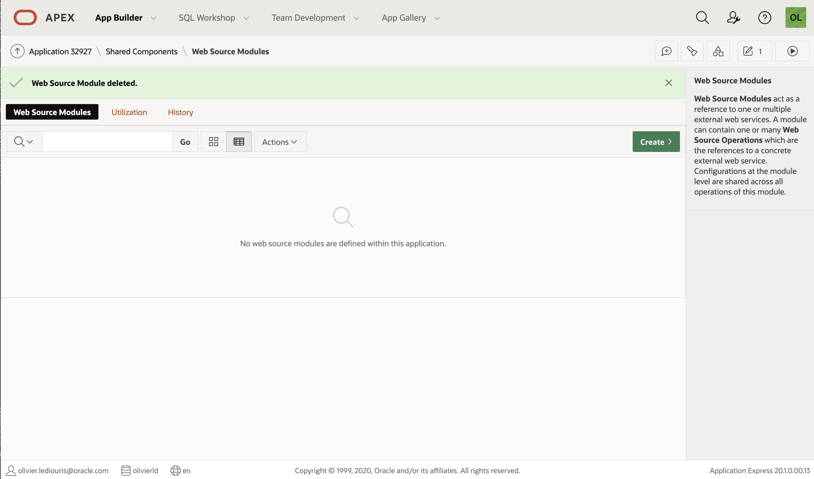
- From Scratch
    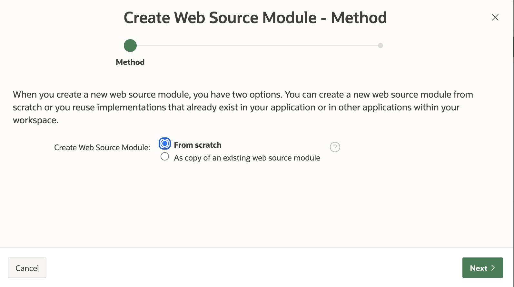
- It's a Simple HTTP Web Source Module, with a parameter `:coordinates`
    
- Click `Next >`
    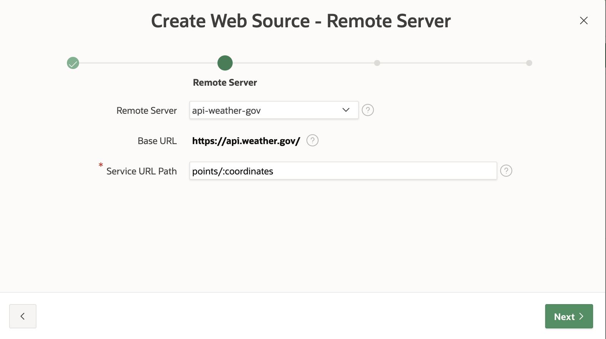
- In the `Authentication` screen, click `Create Module Manually`
    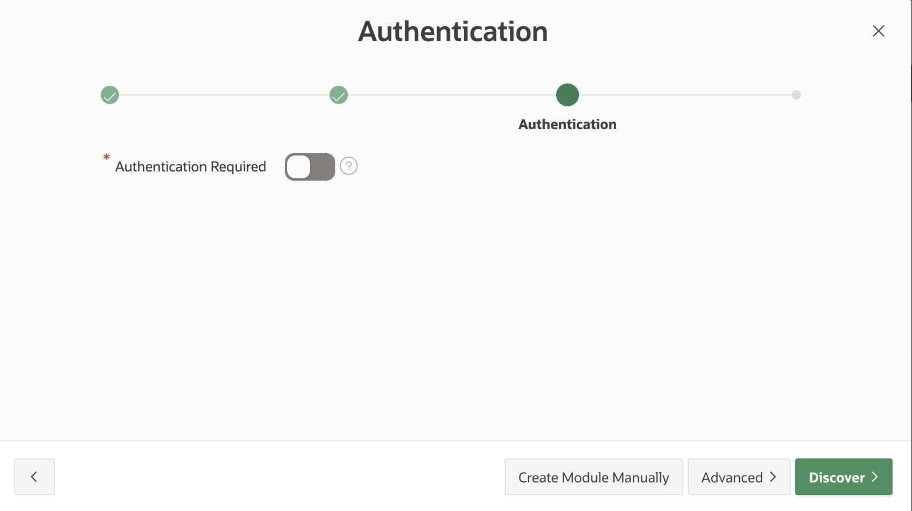
- Click the Module Name in the left column
    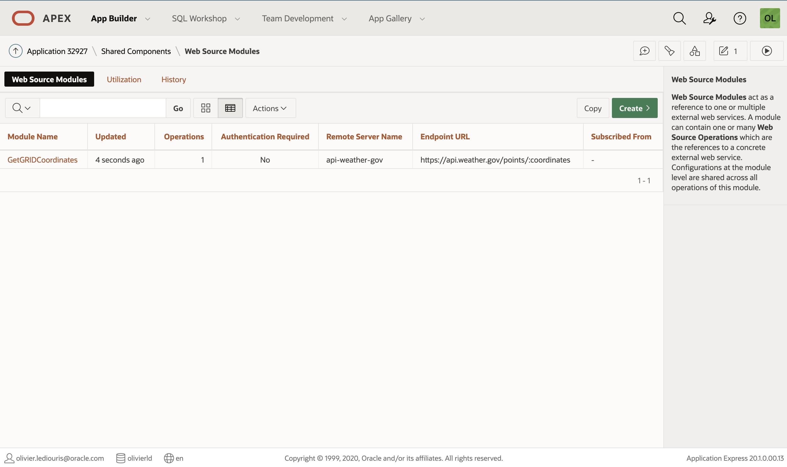
- Click `Edit Data Profile`
    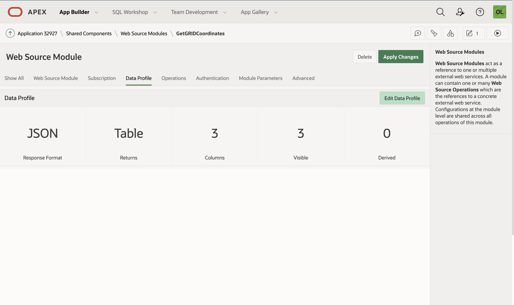
- We will change the `Row Selector`, and the column definitions
    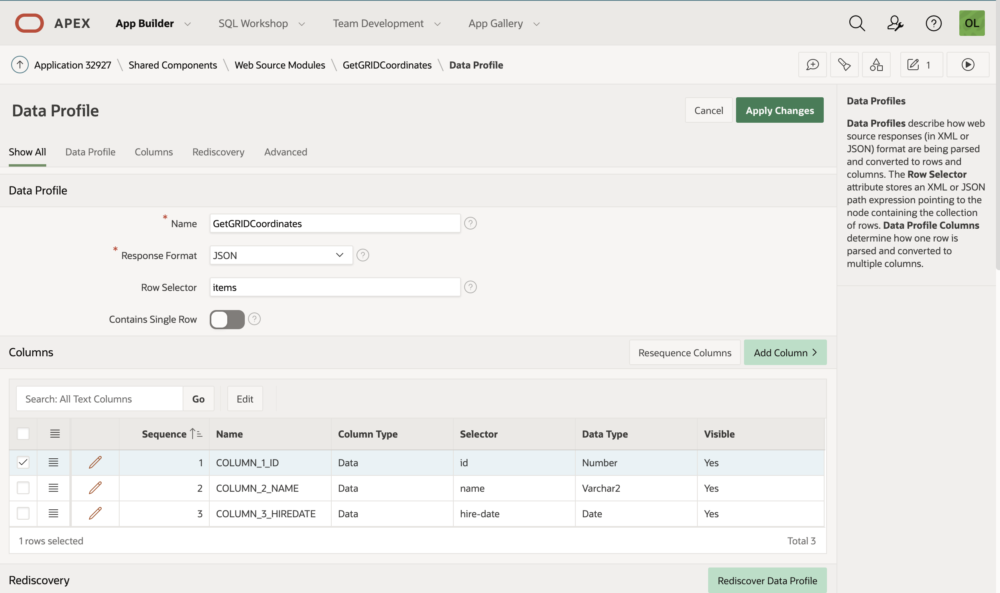
- `Row selector` is set to `properties` as in the returned `JSON` Object, and it is a Single Row.
    
- Once the `properties` row selector is set, we can `Rediscover Data Profile`
    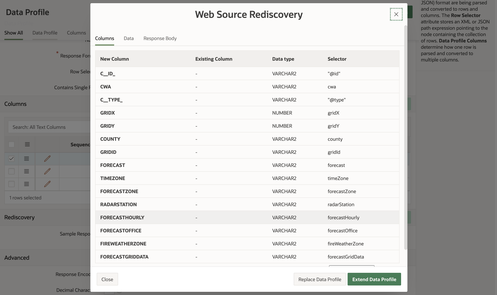
  and it works fine, we see the elements of the `properties` member. But we'll do it manually, as we do not need all those columns,
  we do *not* click the `Extend Data Profile` we just `Close` the dialog.  
- We edit and change the columns definitions, the path (`selector`) is relative to the `Row Selector` 
    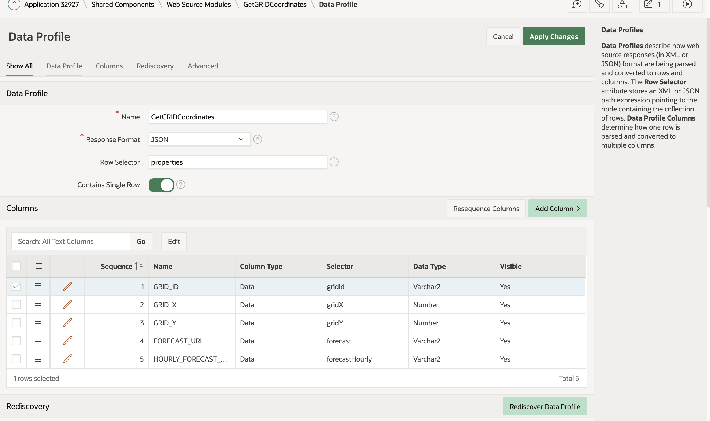
- `Apply Changes`, and now we can create a page
    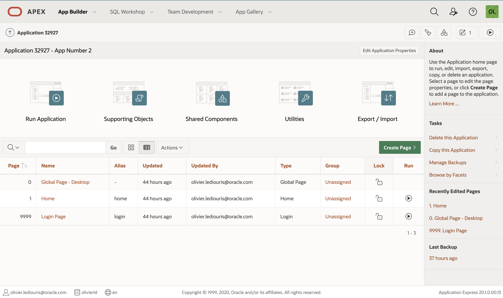
- This will be a `Report`
    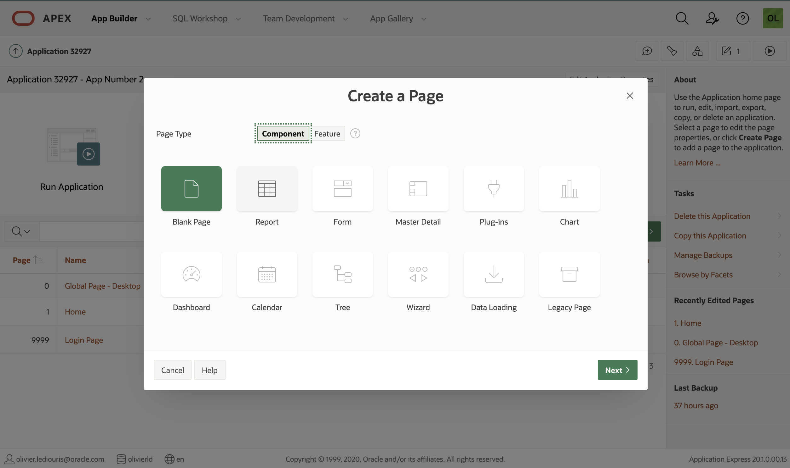
- `Classic Report`
    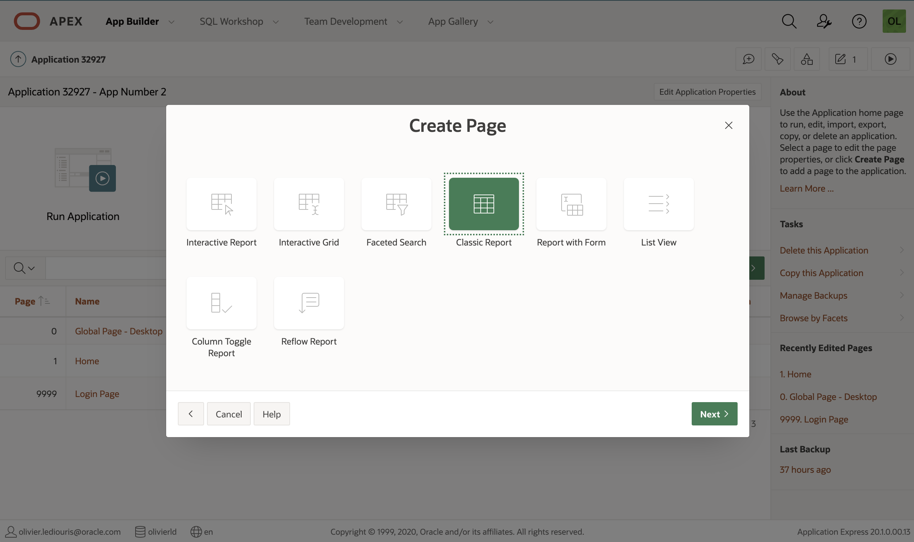
- Named `Grid Coordinates`
    
- Attached to the `Home`
    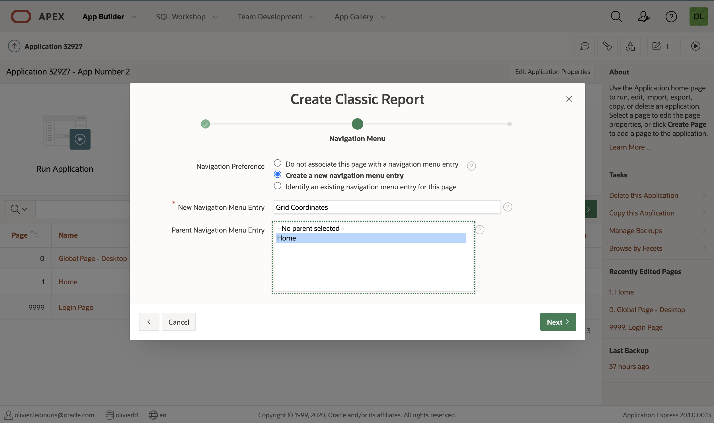
- Based on the just created `Web Source Module`
    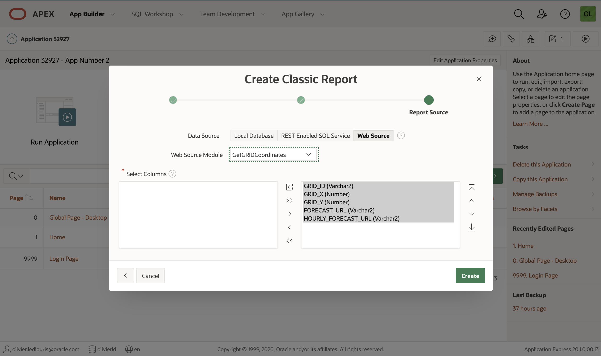
- We can now run it, with the top right button
    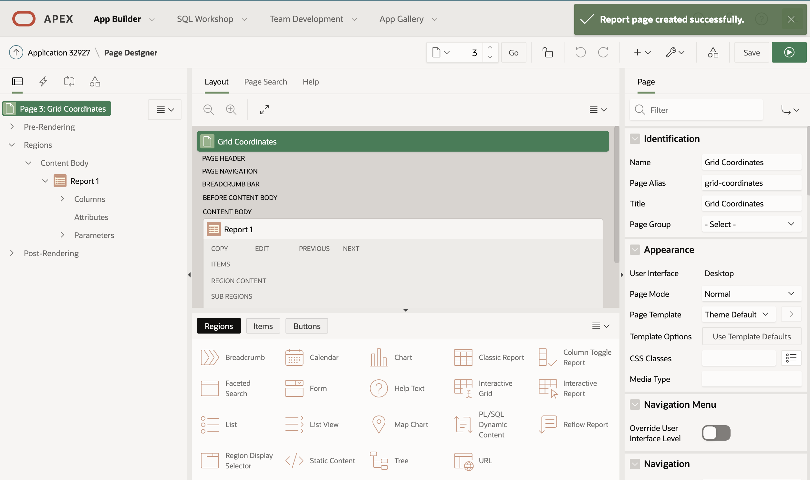
- But there is a `No Data Found` message...
    

---
- Can APEX deal with a single-row returned payload, or does it *have* to be an array?
---

