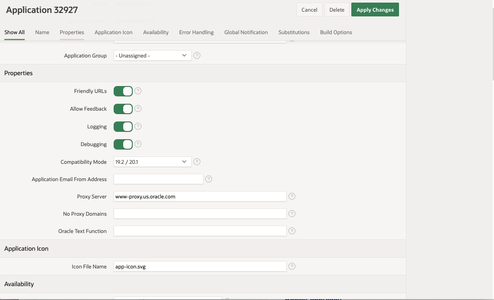

# Simple REST Service call using APEX

Here I want to invoke a REST service like 
```
GET https://api.weather.gov/points/37.75,-122.50
```
This service returns a `JSON` Object, _that is **not** an array_, nor contains any.
All I need is to get to some attributes of the returned payload.

Here is a sample of the returned payload:
```json
{
    "@context": [
        . . .
    ],
    "id": "https://api.weather.gov/points/37.75,-122.5",
    "type": "Feature",
    "geometry": {
        "type": "Point",
        "coordinates": [
            -122.5,
            37.75
        ]
    },
    "properties": {
        "@id": "https://api.weather.gov/points/37.75,-122.5",
        "@type": "wx:Point",
        "cwa": "MTR",
        "forecastOffice": "https://api.weather.gov/offices/MTR",
        "gridId": "MTR",
        "gridX": 85,
        "gridY": 126,
        "forecast": "https://api.weather.gov/gridpoints/MTR/85,126/forecast",
        "forecastHourly": "https://api.weather.gov/gridpoints/MTR/85,126/forecast/hourly",
        "forecastGridData": "https://api.weather.gov/gridpoints/MTR/85,126",
        "observationStations": "https://api.weather.gov/gridpoints/MTR/85,126/stations",
        "relativeLocation": {
            "type": "Feature",
            "geometry": {
                "type": "Point",
                "coordinates": [
                    -122.464979,
                    37.700941
                ]
            },
            "properties": {
                "city": "Daly City",
                "state": "CA",
                "distance": {
                    "value": 6264.6077562384999,
                    "unitCode": "unit:m"
                },
                "bearing": {
                    "value": 330,
                    "unitCode": "unit:degrees_true"
                }
            }
        },
        "forecastZone": "https://api.weather.gov/zones/forecast/CAZ006",
        "county": "https://api.weather.gov/zones/county/CAC075",
        "fireWeatherZone": "https://api.weather.gov/zones/fire/CAZ006",
        "timeZone": "America/Los_Angeles",
        "radarStation": "KMUX"
    }
}
```
What I want is to get to 
- `properties.gridId`
- `properties.gridX` 
- `properties.gridY`
- `properties.forecast`
- `properties.forecastHourly`

The APEX wizards seem not to like the fact that there is no array in the returned payload, we will create 
the `Web Source Module` manually.

- In the APEX UI, I go create a new `Web Source Module`
    
- From Scratch
    
- It's a Simple HTTP Web Source Module, with a parameter `:coordinates`
    
- Click `Next >`
    
- In the `Authentication` screen, click `Create Module Manually`
    
- Click the Module Name in the left column
    
- Click `Edit Data Profile`
    
- We will change the `Row Selector`, and the column definitions
    
- `Row selector` is set to `properties` as in the returned `JSON` Object, and it is a Single Row.
    
- Once the `properties` row selector is set, we can `Rediscover Data Profile`
    
  and it works fine, we see the elements of the `properties` member. But we'll do it manually, as we do not need all those columns,
  we do *not* click the `Extend Data Profile` we just `Close` the dialog.  
- We edit and change the columns definitions, the path (`selector`) is relative to the `Row Selector` 
    
- `Apply Changes`, and now we can create a page
    
- This will be a `Report`
    
- `Classic Report`
    
- Named `Grid Coordinates`
    
- Attached to the `Home`
    
- Based on the just created `Web Source Module`
    
- We can now run it, with the top right button
    
- But there is a `No Data Found` message...
    

---
- Can APEX deal with a single-row returned payload, or does it *have* to be an array?
---

## App Properties


### In `SQL Workshop`
```
declare
    l_clob clob;
begin
    apex_web_service.g_request_headers.delete;
    apex_web_service.g_request_headers(1).name := 'User-Agent';
    apex_web_service.g_request_headers(1).value := 'Oracle Application Express';
    l_clob := apex_web_service.make_rest_request('https://api.weather.gov/points/37.75,-122.50','GET', p_proxy_override=>'pdit-b2b-proxy.oraclecorp.com:80');
end;
```
The proxy is blocking the `User-Agent`.

At run time, APEX sends the "User Agent" request header; at design time it does not
and for some reason, the request with the User Agent header is blocked by the proxy
So you could raise a ticket with OIT, paste in this code snippet and ask for help to get these requests across the proxy
must be resolved by operations people

Try this:
```
declare
    l_json json_object_t;
    l_clob clob;
    l_properties json_object_t;
    l_gridX number;
    l_gridY number;
begin
    apex_web_service.g_request_headers(1).name := 'User-Agent';
    apex_web_service.g_request_headers(1).value := 'Mozilla/5.0 (Macintosh; Intel Mac OS X 10_15_7) AppleWebKit/537.36 (KHTML, like Gecko) Chrome/85.0.4183.121 Safari/537.36';
    apex_web_service.g_request_headers(2).name := 'Accept';
    apex_web_service.g_request_headers(2).value := 'application/geo+json';
    l_clob := apex_web_service.make_rest_request(
            p_url => 'https://api.weather.gov/points/37.7488,-122.507',
            p_http_method => 'GET'
    );
    l_json := json_object_t.parse(l_clob);
    l_properties := l_json.get_object('properties');
    l_gridX := l_properties.get_number('gridX');
    l_gridY := l_properties.get_number('gridY');
    htp.p(to_char(l_gridX));
    htp.p(to_char(l_gridY));
end;
```

That one works:
```
declare
    l_json json_object_t;
    l_clob clob;
    l_from json_object_t;
    l_to json_object_t;
    l_from_lat number;
    l_from_lng number;
    l_to_lat varchar2(32);
    l_to_lng varchar2(32);
begin
    apex_web_service.g_request_headers.delete;
    apex_web_service.g_request_headers(1).name := 'Accept';
    apex_web_service.g_request_headers(1).value := 'application/json';
    apex_web_service.g_request_headers(2).name := 'User-Agent';
    apex_web_service.g_request_headers(2).value := 'Oracle Application Express';
    
    l_clob := apex_web_service.make_rest_request('http://slc11aaf.us.oracle.com:8080/rest/geopos/37.75,-122.50','GET'); -- , p_proxy_override=>'www-proxy.us.oracle.com:80');
    -- dbms_output.put_line('Result:' || l_clob);
    
    htp.p('Raw json:' || to_char(l_clob));

    l_json := json_object_t.parse(l_clob);
    l_from := l_json.get_object('from');
    l_from_lat := l_from.get_number('lat');
    l_from_lng := l_from.get_number('lng');
    
    l_to := l_json.get_object('to');
    l_to_lat := l_to.get_string('lat');
    l_to_lng := l_to.get_string('lng');
    
    htp.p('Lat from:' || to_char(l_from_lat));
    htp.p('Lng from:' || to_char(l_from_lng));

    htp.p('Lat to:' || to_char(l_to_lat));
    htp.p('Lng to:' || to_char(l_to_lng));
end;
```
